# Creating an AWS-Based End-to-End Cloud Solution using the STM32U5 IoT Sensor Node
# 

### Introduction

In this tutorial we will:

- create a rule in AWS IoT Core to send sensors' data from MQTT topic to Amazon Timestream
- observe the data in Amazon Timestream database (which is AWS specialized serverless database for time-series data)
- log in to Grafana workspace and configure the dashboard
- visualize the data from STM32U5 IoT Sensor Node environmental sensors (temperature, humidity, and barometric pressure) in Grafana

Every participant will have individual AWS account to experiment with. Accounts are provisioned using Workshop Studio and will be terminated after the workshop.
A number of components were pre-provisioned in the accounts already using [AWS CloudFormation](https://aws.amazon.com/cloudformation/), namely:
- [Amazon Timestream](https://aws.amazon.com/timestream/) database and table
- [AWS Fargate](https://aws.amazon.com/fargate/) running Docker container with Grafana application
- [Amazon Cloudfront](https://aws.amazon.com/cloudfront/) CDN distribution with TLS certificate to protect Grafana internet facing dashboard.
- Number of [AWS Identity and Access Management](https://aws.amazon.com/iam/) policies and roles, governing how the services can interact with each other.

If you want to recreate workshop in your **own** AWS account, please download [sensor_data_ingestion.yaml](https://github.com/ashmagin/STM32U5VirtualWorkshop2023/sensor_data_ingestion.yaml) and [iot_policy.yaml](https://github.com/ashmagin/STM32U5VirtualWorkshop2023/iot_policy.yaml) CloudFormation templetes to create those stacks.

### Log in to Workshop Studio AWS account

Let's log in to the workshop account using One Time Password (OTP) method from the [workshop landing page](https://catalog.us-east-1.prod.workshops.aws/join?access-code=0760-05334e-84)

1. Select **Email One-time Password**
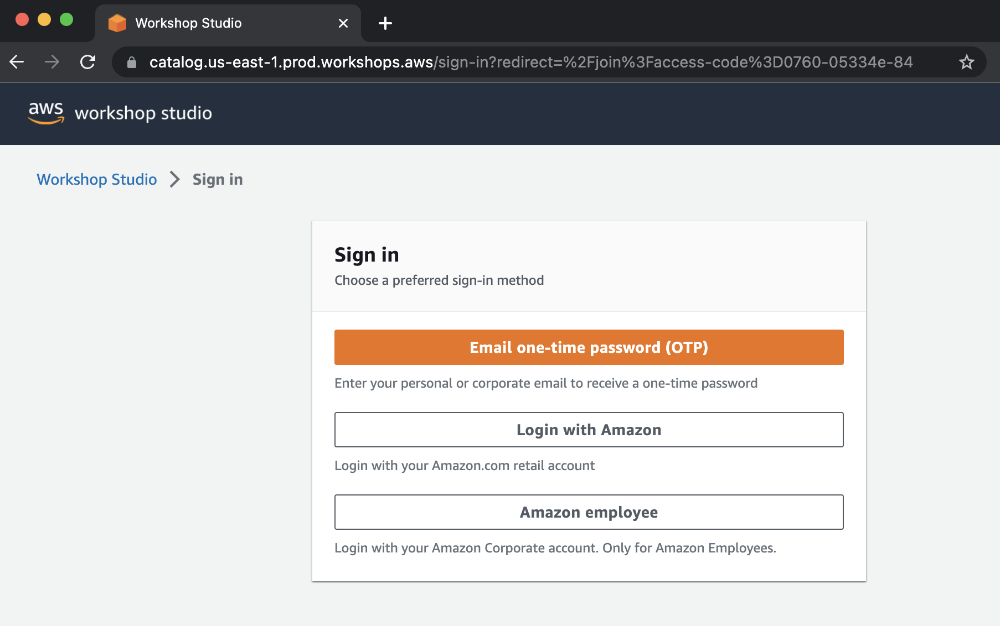

2. Enter your email and press **Send passcode**
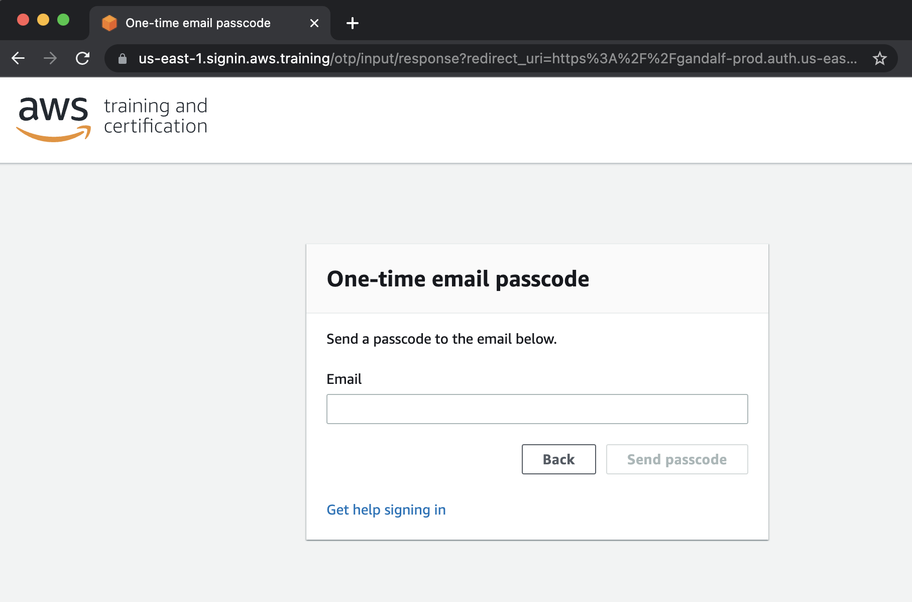

3. Check your email and enter the 9-digit value in the prompt and press **Sign in**
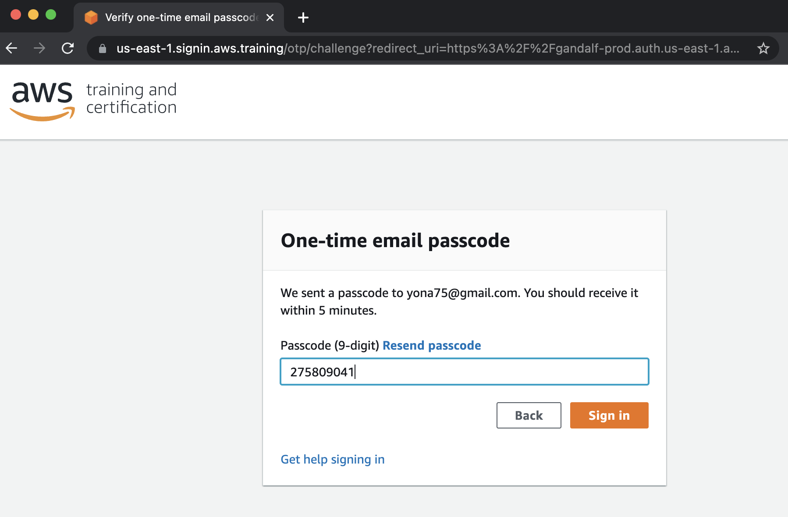

4. Tick the checkbox accepting the Terms and conditions and press **Join Event**
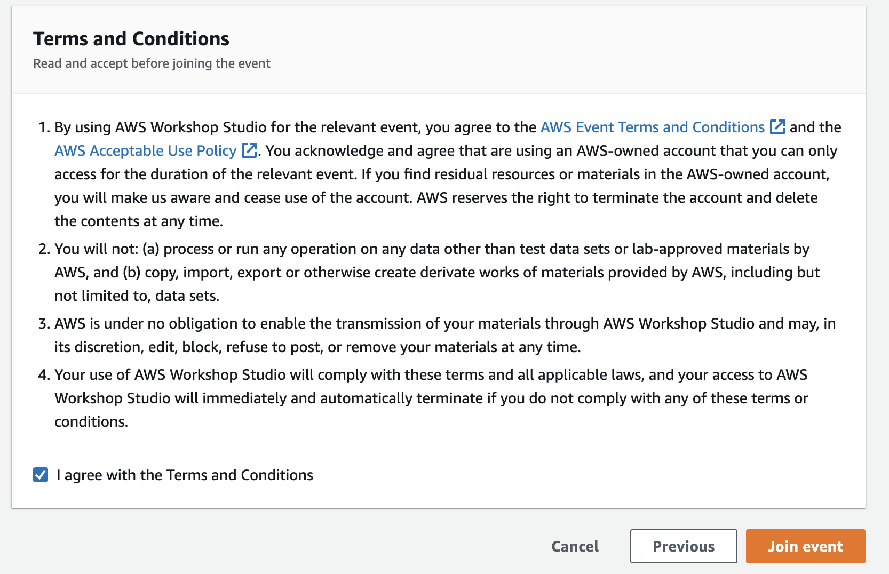

5. At the left bottom panel *"AWS Account access"* select **Open AWS Console (us-east-1)**
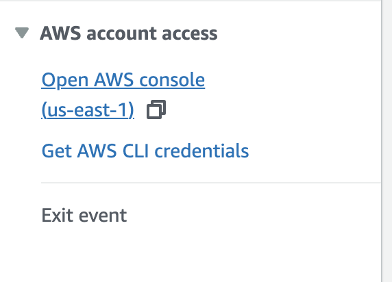

### MQTT topics structure and payload format

In the STM32U5 AWS QuickConnect workshop, you should already know the deviceID. If not open the serial console to STM32U5 and reset the board pressing the black RST button. Look for the string similar to:

```
<INF>      790 [MQTTAgent ] Client Certificate: CN=stm32u5-a61b1620323443M0, SN:0x5A7C3C321EDBC7F9
```
The CN value is the first level MQTT topic that your device is publishing on. Environmental sensors are published to:

```
stm32u5-XXXXXXXXXXXXXXXX/env_sensor_data
```
In my case it is *stm32u5-8b74032038373303/env_sensor_data*

The payload for environmental sensors is a structured JSON:

```json
{
  "temp_0_c": 34.11742,
  "rh_pct": 30.602741,
  "temp_1_c": 34.150002,
  "baro_mbar": 1000.073242
}
```
It is important as it allows rule engine to do transformation and enrichment of data on the fly.

Let's verify that our STM32U5 IoT Discovery Node sends messages to AWS IoT Core.

1. In the AWS Console navigate to **Services $\to$ Internet of Things $\to$ IoT Core**.
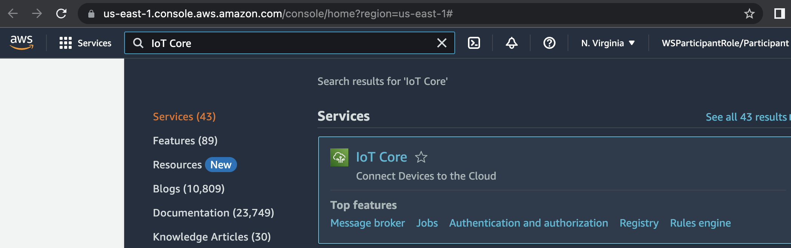

2. Navigate to **MQTT Test Client**. Subscribe to all MQTT topics by entering **#** symbol in the Subscribe field and click **Subscribe**
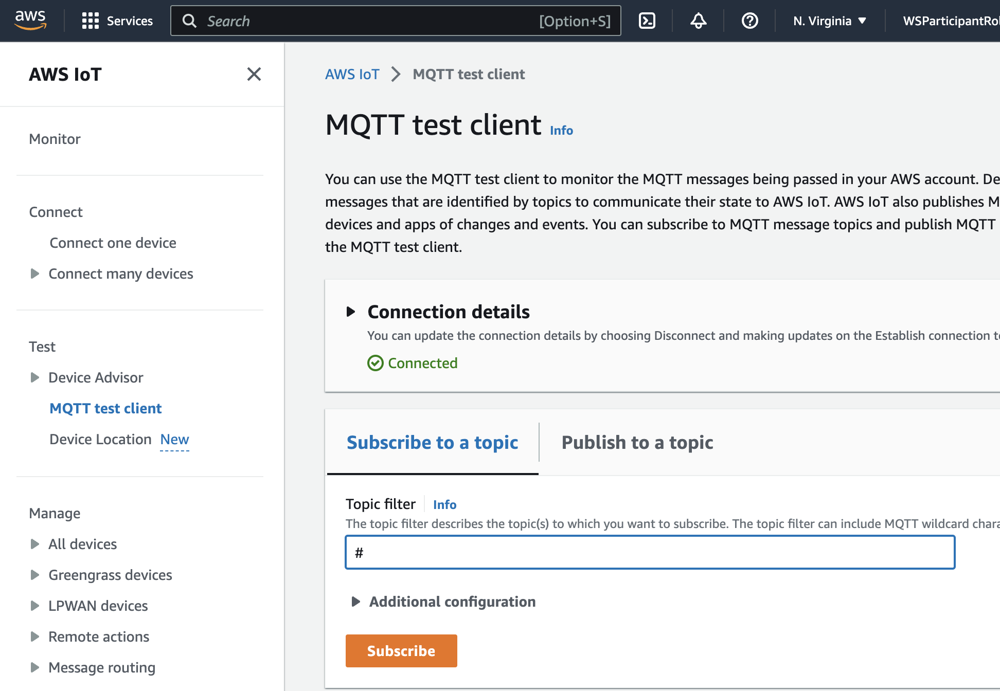

3. Observe messages. Click on pause, copy and save your MQTT topic. Remember, it has format *stm32u5-XXXXXXXXXXXXXXXX/env_sensor_data*. We will need that value later.
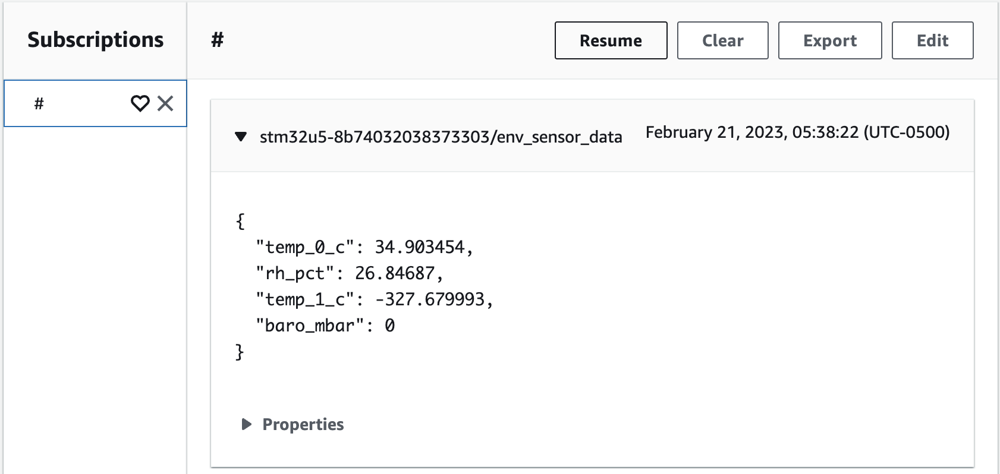

Now that we know our topic structure and payload, lets publish that data to Amazon Timestream database.


### AWS IoT Core Rules

AWS IoT rules give your devices an ability to send the data from MQTT topics to a variety of AWS services, such as S3, DynamoDB, Lambda, OpenSearch, Timestream, etc. Rules also can perform data filtering and transformation. To learm more refer to [official documentation](https://docs.aws.amazon.com/iot/latest/developerguide/iot-rules.html).

1. In the AWS Console navigate to **Services $\to$ Internet of Things $\to$ IoT Core**. On that screen from the left-hand panel chose **Message Routing $\to$ Rules**


2. Create the rule with the name *MQTTtoTimestream* and description *Send data from STM32U5 environmental sensors to Amazon Timestream timeseries database*. Click **Next**
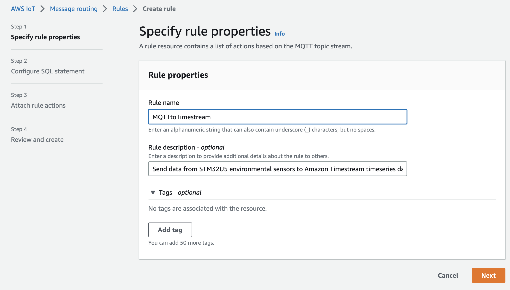

3. Enter the SQL statement to get temperature and humidity reading from environmental sensors payload and click **Next**
```sql
SELECT temp_0_c AS temperature, rh_pct AS humidity, baro_mbar AS pressure FROM 'stm32u5-XXXXXXXXXXXXXXXX/env_sensor_data'
```
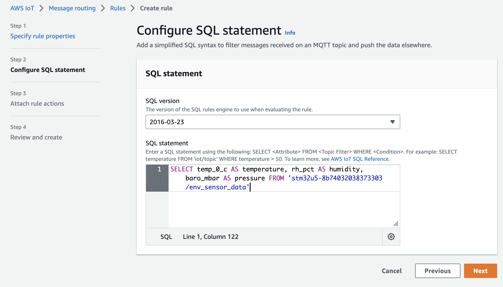

4. Attach the action. Choose **Timestream table** as the Action, select *SensorData* database and *stm32u5* as a table. Configure the dimension with the dimension name *name* and dimension value *stm32u5*. For IAM role, search for *sensor-data-ingestion-TimestreamInsertRole-XXXXXXXXXXXX* role.
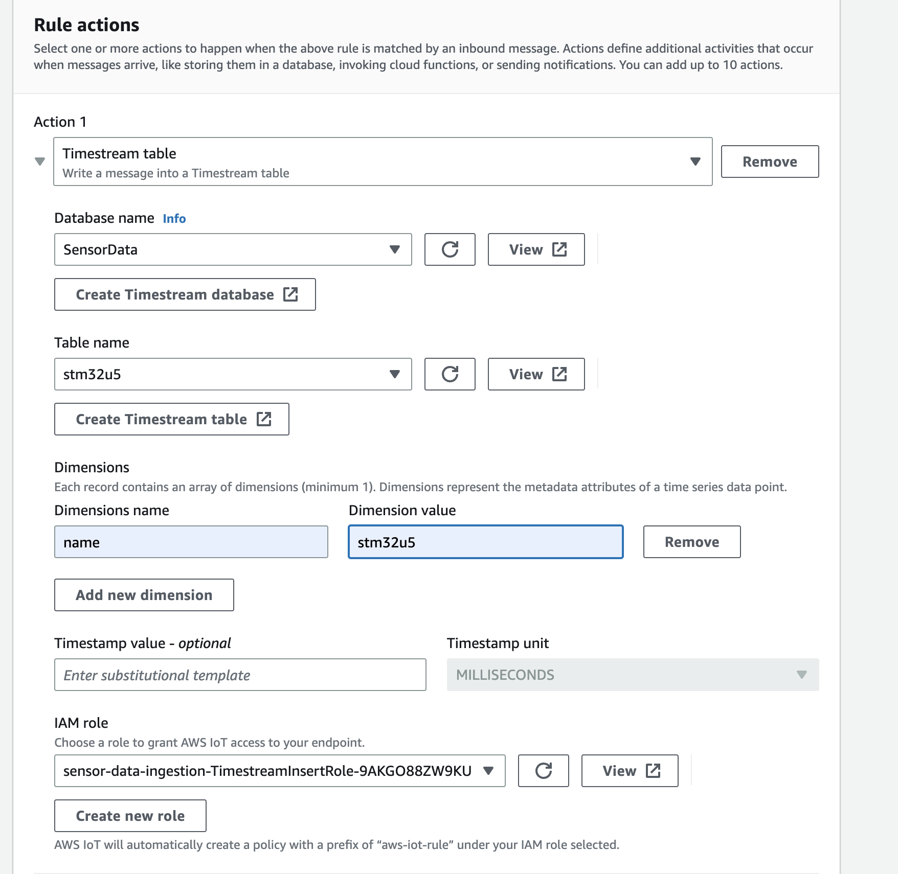

5. Inspect the input and click **Create**
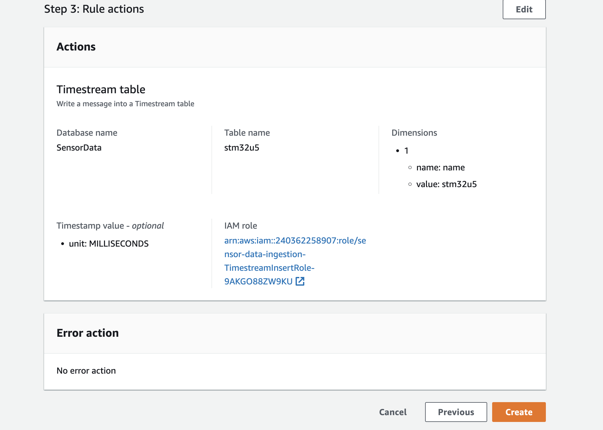

### Amazon Timestream

Let's verify that the rule is sending the data to the database

1. In the AWS Console navigate to **Services $\to$ Database $\to$ Amazon Timestream**. Or Search for *"Timestream"*
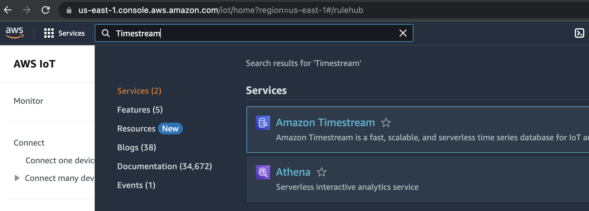

2. Expand the left-side navigation panel by clicking on **$\equiv$** symbol
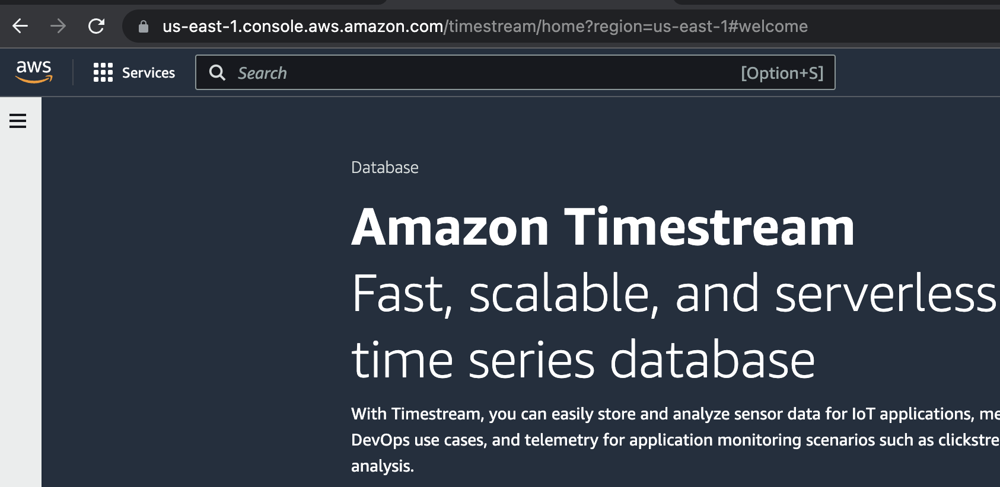

3. Navigate to **Management Tools $\to$ Query Editor**. Find *stm32u5* table and click on the triple vertical dots on the right-hand side. Click on **Preview data**
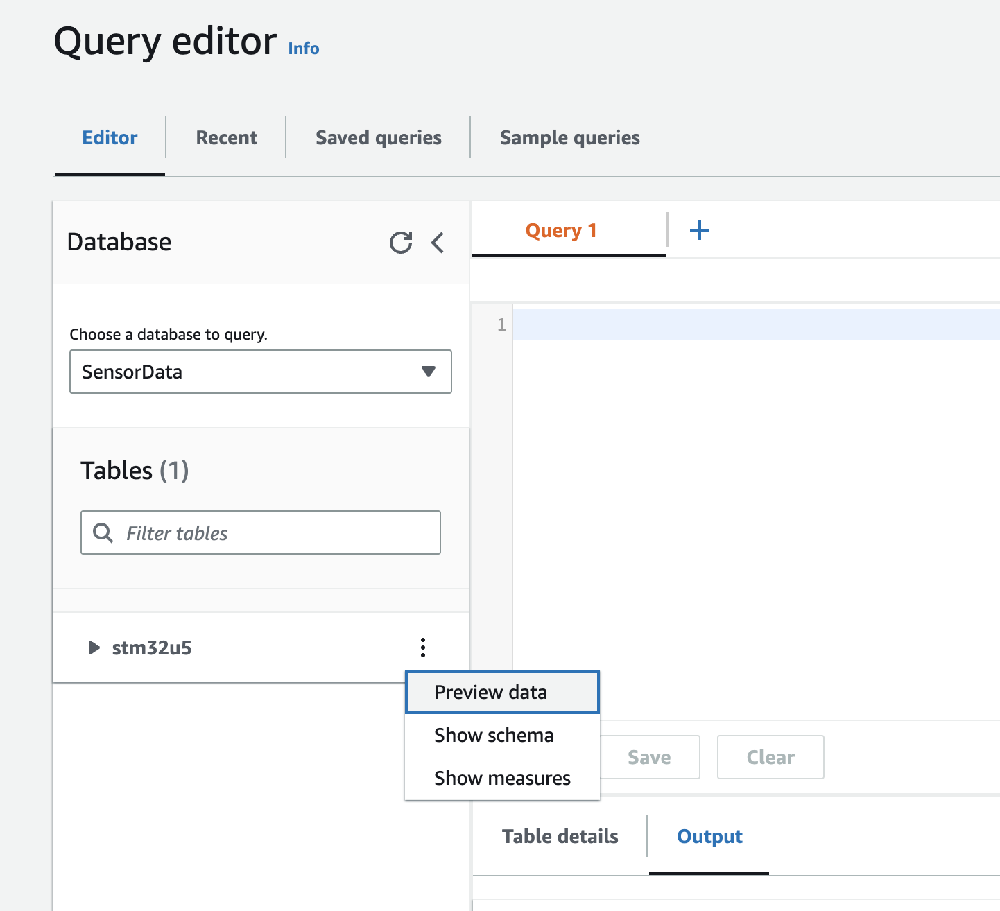

4. Run the query
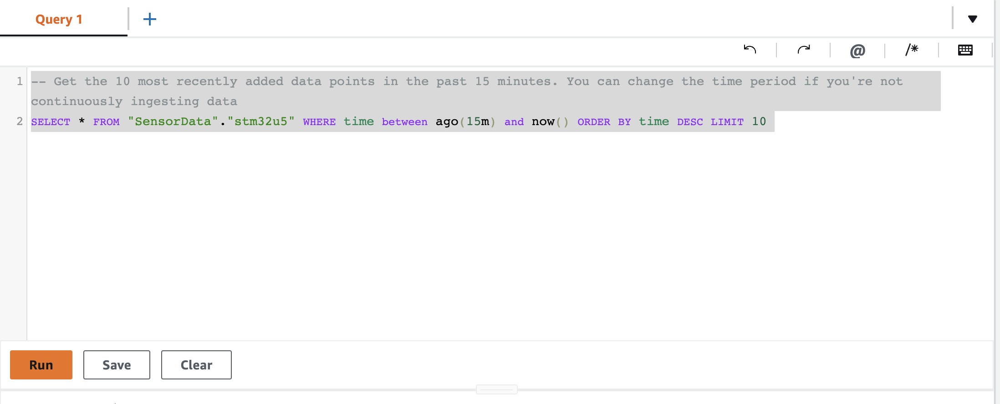

5. Inspect the result
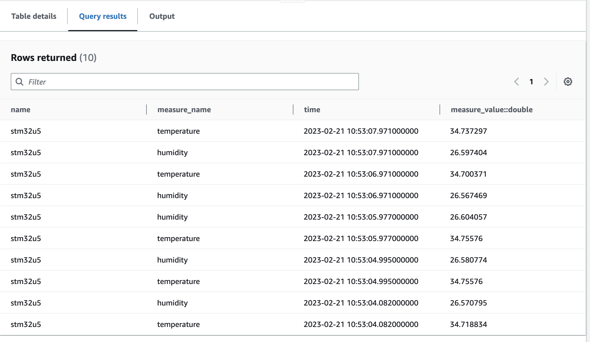

### Amazon Grafana

1. In AWS Console navigate to **Services $\to$ Management&Governance $\to$ CloudFormation**
2. Click on *sensor-data-ingestion* stack and then inspect *Outputs* tab. There should be *Grafana URL* filed. Click on the URL that should look similar to http://dxxxxxxxxxxxx.cloudfront.net/
3. In the Grafana login screen use *workshop* as username and *stm32u5* as a password
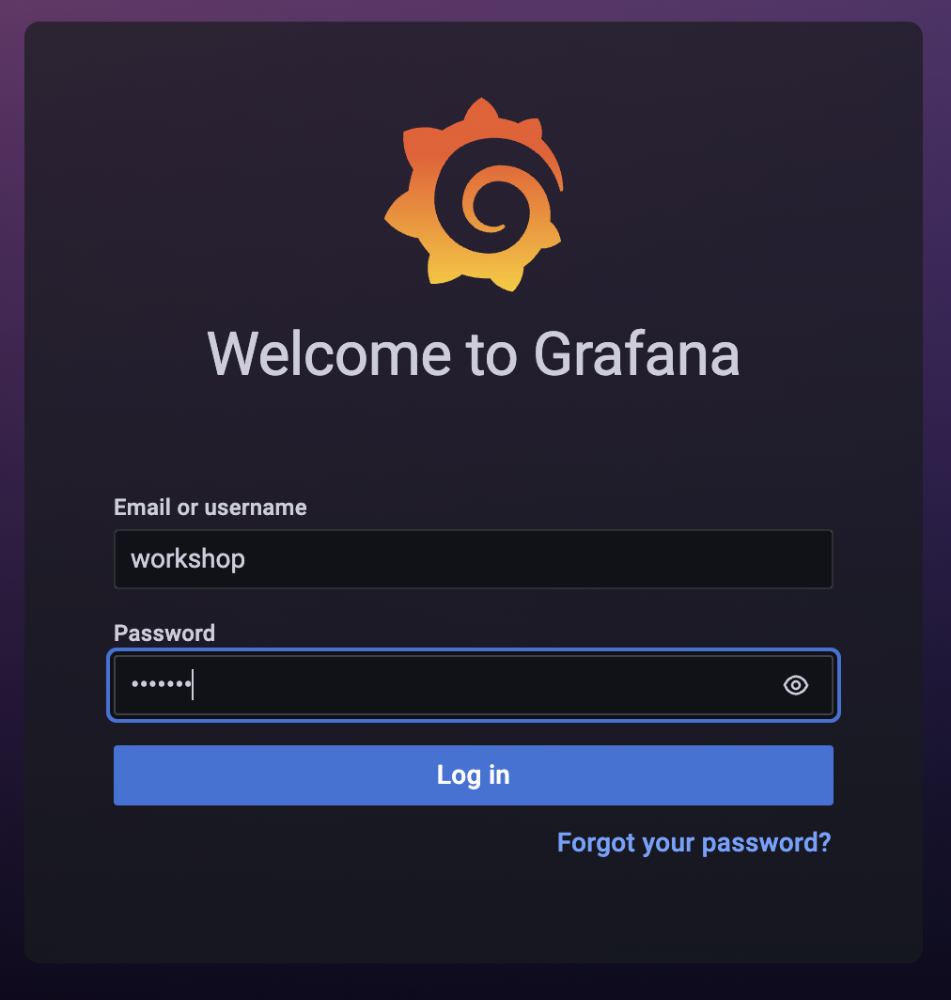

4. Dashboard should start displaying the values from Amazon Timestream stm32u5 table. If values are not displayed, please click **Edit** on correspondent widget and verify that the query and the measurement fields are correct. The dashboard should look like this.
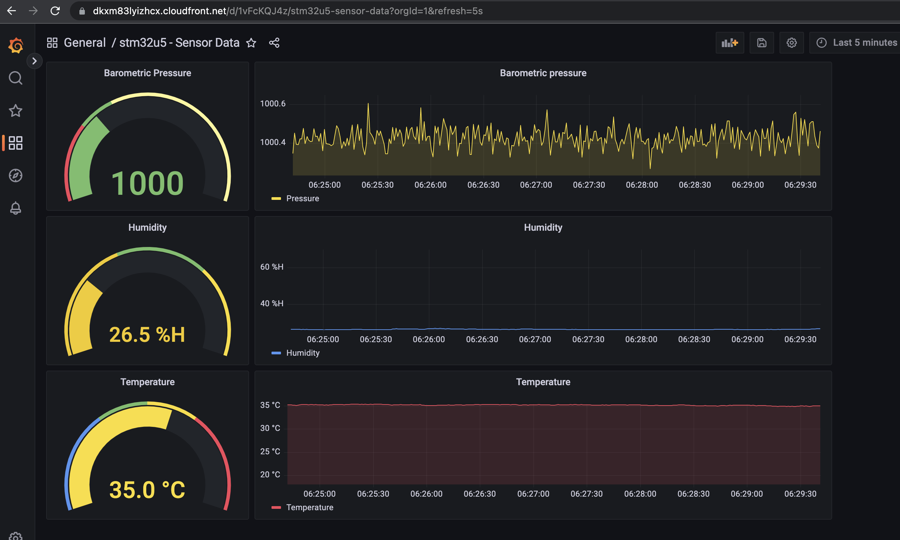

5. Please note that temperature on the sensor can be significantly higher than ambient due to the proximity to WiFi module that gets warm quickly
6. Breathe at the board and observe the humidity graph changes

### This concludes the workshop 
